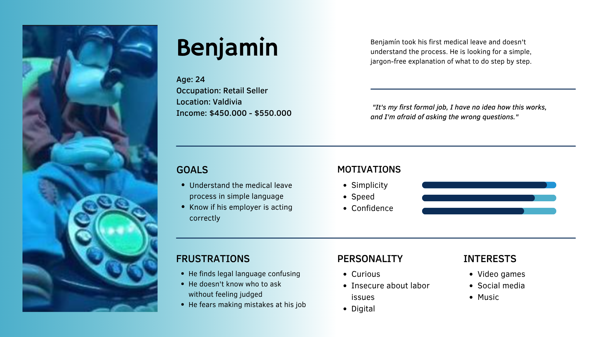
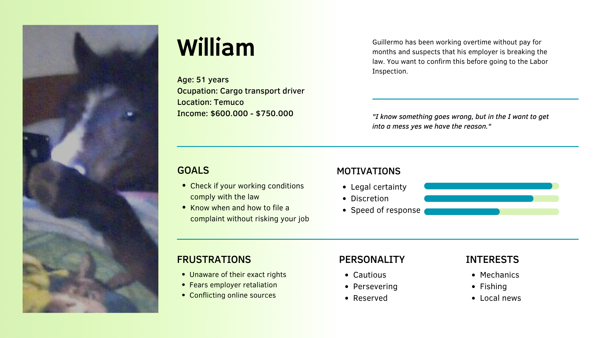
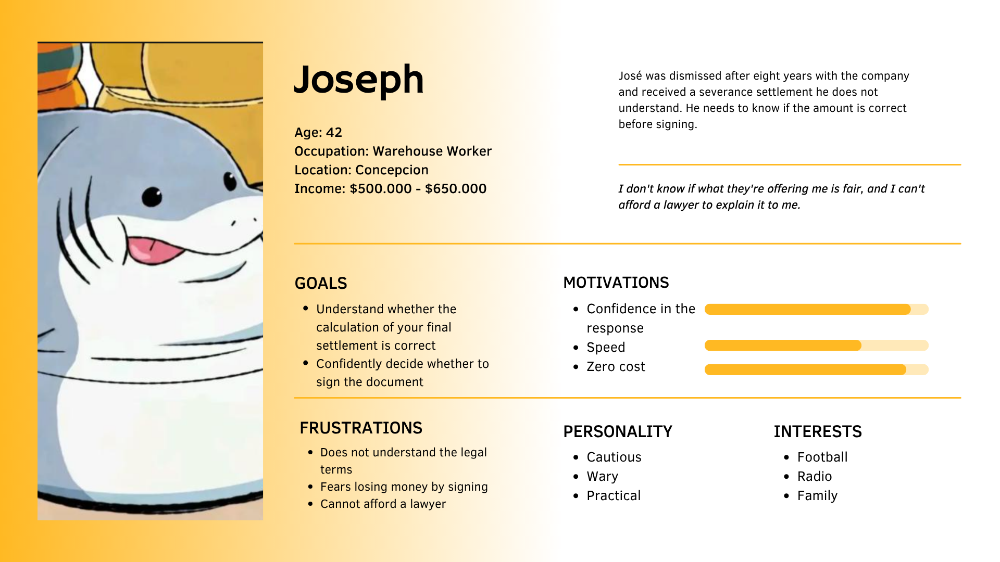
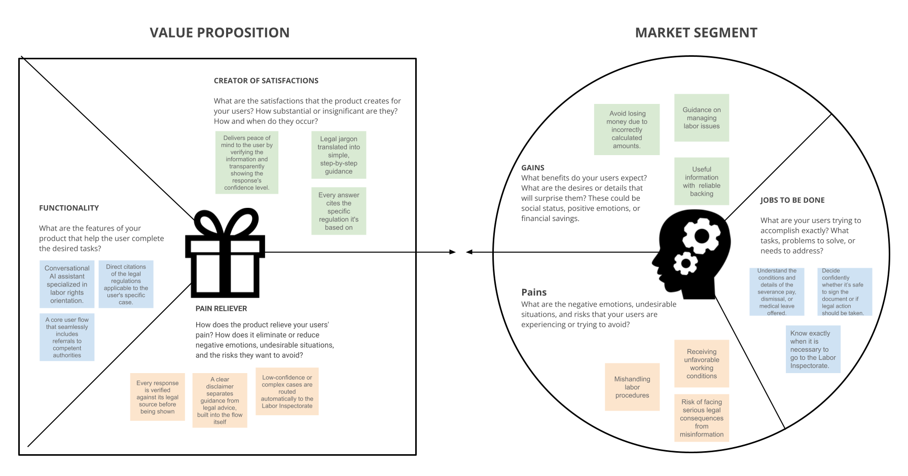

# Human-Computer Interface Design

Semester project repository for the Human-Computer Interface Design course at the University of La Frontera (UFRO), Temuco, Chile. It records each completed course activity and the design decisions behind an AI-assisted labor rights guidance concept.

## Course team

| Role | Name |
| --- | --- |
| Instructor | Jaime Ignacio Diaz |
| Team leader | Guillermo Salgado |
| Team member | Benjamin Fonseca |
| Team member | Jose Villablanca |

## Selected project

**Verified AI-assisted labor rights guidance** addresses a trust problem: conversational AI may give plausible but incorrect answers about dismissals, severance settlements, or medical leave. The proposed experience should explain labor rights in plain language, cite the applicable rules, communicate uncertainty and its own limits, and guide people to the Labor Inspectorate when their case requires official assistance.

The course classifies this initiative in the **labor** domain with **high UX complexity**. Its representative scenario is a worker who receives a severance settlement they do not understand and needs to decide whether to sign it or seek help.

Read the [project brief](docs/project-brief.md) for the translated assignment context, design requirements, and selected problem.

## Completed activities

### 1. UX personas

We created three personas to describe distinct labor rights situations and the information each worker needs. Their goals and frustrations frame the language, trust cues, and referral paths the interface must support.

| Persona | Situation | Main need |
| --- | --- | --- |
| Benjamin | A retail worker navigating his first medical leave | Simple, step-by-step guidance without legal jargon |
| William | A cargo transport driver checking unpaid overtime | Reliable information and a discreet route to a complaint |
| Joseph | A warehouse worker reviewing a severance settlement after dismissal | Understand the calculation before deciding whether to sign |

#### Benjamin



#### William



#### Joseph



### 2. Value Proposition Canvas

We mapped workers' jobs, pains, and desired gains to the product's proposed features, pain relievers, and benefits. The canvas links needs such as understanding a settlement, handling medical leave, and knowing when to contact the Labor Inspectorate to plain-language guidance, legal citations, visible confidence levels, and referral to the competent authority.



## Semester workflow

The assignment calls for a full user-centered design process: UX research, problem definition, iterative prototyping, evaluation with users, and a high-fidelity interface proposal. Future activities will be added here as they are completed. Design decisions should remain traceable to the evidence gathered during the semester.

## Repository contents

```text
.
├── README.md
├── docs/
│   └── project-brief.md
├── ux-personas/
│   ├── 1.png
│   ├── 2.png
│   └── 3.png
└── value_proposition.png
```
