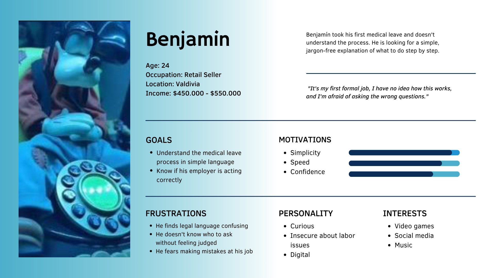
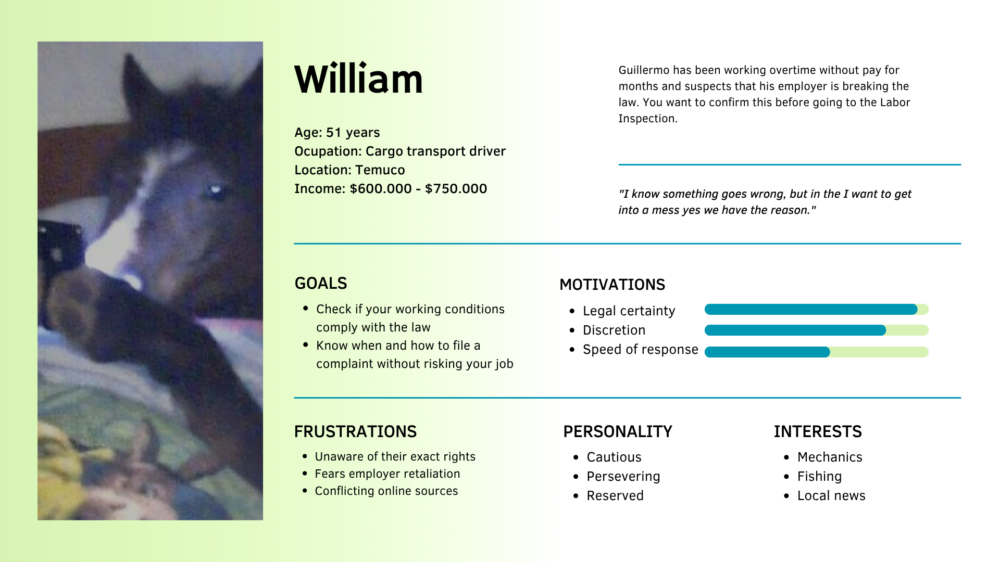
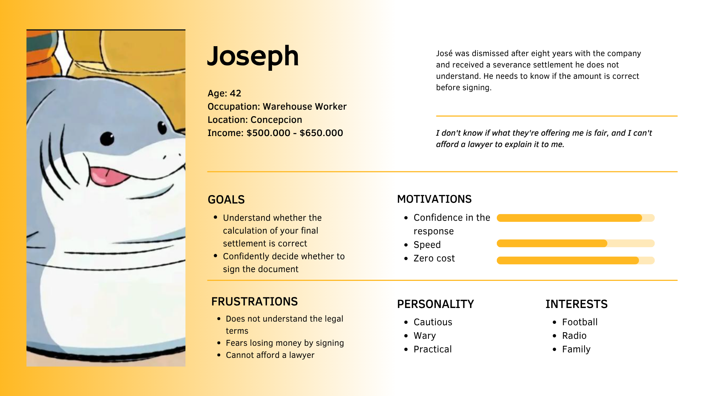
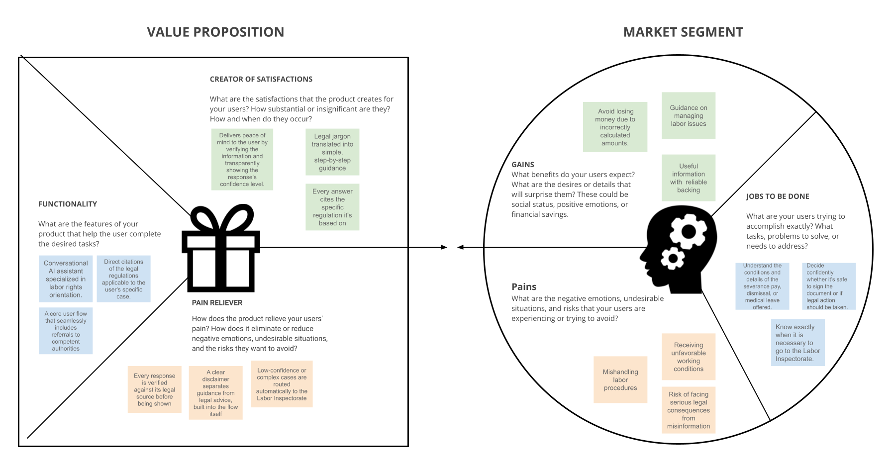
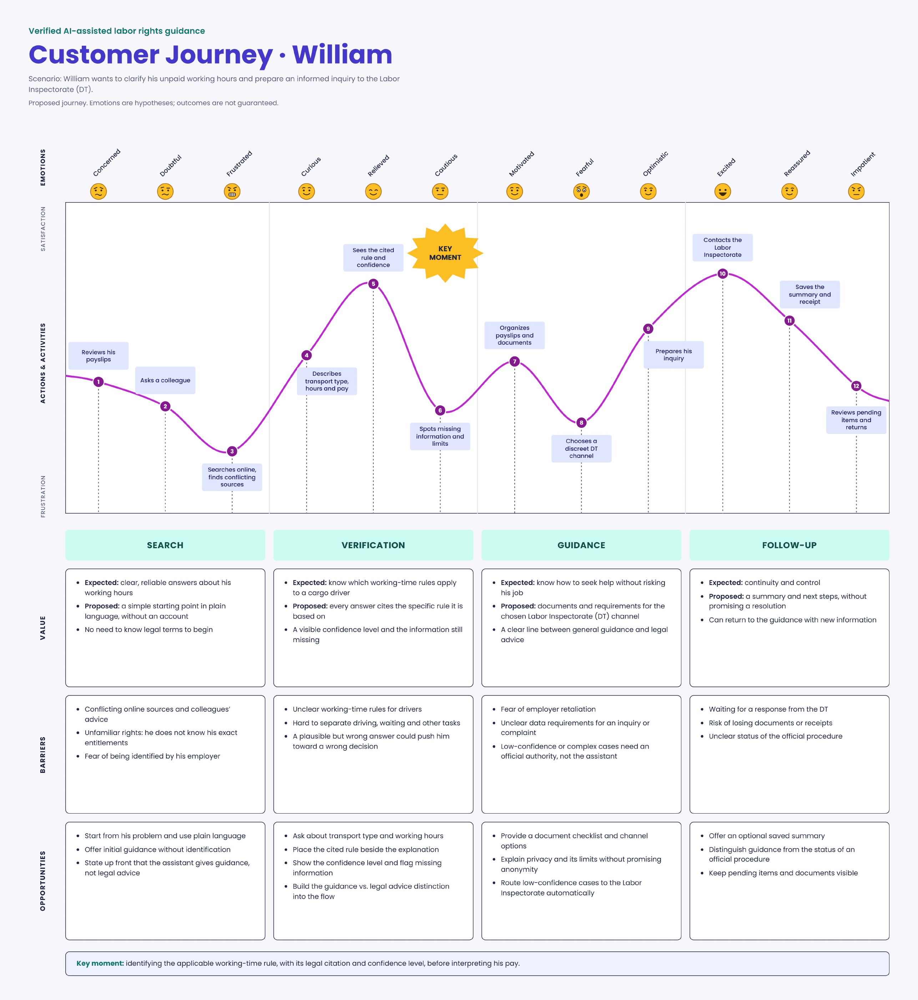

# Diseño de Interfaz Humano Computador

Repositorio del proyecto semestral de Diseño de Interfaz Humano Computador de la Universidad de La Frontera (UFRO), Temuco, Chile. Registra las actividades y decisiones de diseño de una propuesta de orientación laboral asistida por IA con verificación.

## Equipo

| Rol | Nombre |
| --- | --- |
| Docente | Jaime Ignacio Diaz |
| Líder | Guillermo Salgado |
| Integrante | Benjamin Fonseca |
| Integrante | Jose Villablanca |

## Proyecto seleccionado

**Orientación en derechos laborales asistida por IA con verificación** aborda un problema de confianza: una IA conversacional puede ofrecer respuestas plausibles pero incorrectas sobre despidos, finiquitos o licencias médicas. La experiencia propuesta debe explicar en lenguaje simple, mostrar el respaldo normativo, comunicar sus límites y facilitar atención del organismo competente cuando haga falta.

El encargo clasifica el proyecto en el dominio **laboral**, con **complejidad UX alta**. El escenario representativo es un trabajador que recibe un finiquito que no comprende y necesita decidir cómo proceder con información y apoyo adecuados. [Contexto y requisitos del proyecto](docs/project-brief.md).

## Actividades

### 1. Personas UX

Tres perfiles describen situaciones y necesidades distintas. Las imágenes originales se conservan como antecedente. El perfil de conductor figura como «William» en el título de la imagen y «Guillermo» en su descripción; la entrega definitiva del Customer Journey conserva el nombre **William** del documento proporcionado por el equipo.

| Persona | Situación | Necesidad principal |
| --- | --- | --- |
| Benjamin | Vendedor de retail, primera licencia médica | Guía simple, paso a paso y sin jerga. |
| Guillermo | Conductor de carga, horas que considera impagas | Información pertinente a su jornada y una ruta discreta de orientación. |
| Joseph | Bodeguero, revisión de finiquito tras despido | Entender conceptos y antecedentes antes de decidir. |

#### Benjamin

#### Guillermo

#### Joseph

### 2. Propuesta de valor

El Canvas relaciona tareas, frustraciones y beneficios con explicación simple, fuentes normativas, verificación, límites y derivación. El [benchmark](benchmark/README.md) propone refinar el destino de derivación por materia y expresar la confianza mediante evidencia y datos faltantes.

### 3. Benchmarking competitivo

[Análisis y hallazgos](benchmark/README.md) · [Tabla comparativa](benchmark/tabla-comparativa.md) · [Informe PDF en APA 7](benchmark/benchmark.pdf) · [Fuentes LaTeX](benchmark/latex/README.md).

Se comparan **Dirección del Trabajo** (directo), **SUSESO** (análogo) y **ChileAtiende** (referencia de diseño). Incluye nueve capturas anotadas, diez dimensiones base, cuatro del dominio y decisiones propuestas para el prototipo. Fecha: 5 de octubre de 2026; alcance documental e interfaces públicas.

### 4. Customer Journey

El recorrido definitivo de **William**, correspondiente a la persona del conductor de carga, muestra cómo pasa de revisar sus pagos a preparar una consulta ante la Dirección del Trabajo. Está en inglés y organiza **doce acciones en cuatro etapas**: Search, Verification, Guidance y Follow-up, con curva emocional, valor, barreras y oportunidades.

El momento clave es identificar la regla de jornada aplicable, su respaldo y el nivel de confianza antes de interpretar el pago. El recorrido y las emociones son hipótesis para validar.

[Documento definitivo en PDF](customer-journey/Customer%20Journey%20%C2%B7%20William.pdf) · [Descripción de la entrega](customer-journey/README.md).

Las observaciones del benchmark proceden de interfaces públicas; no representan entrevistas ni pruebas de trámites autenticados.

## Proceso semestral

El encargo requiere investigación UX, definición del problema, prototipos iterativos, evaluación con usuarios y propuesta de interfaz en alta fidelidad. Cada decisión debe poder justificarse con la evidencia recopilada. Las actividades actuales alimentan Estrategia y Alcance y preparan el flujo de navegación.

## Organización

- `docs/`: contexto del encargo y comprobación de la pauta.
- `ux-personas/` y `value_proposition.png`: artefactos originales.
- `benchmark/`: análisis, tabla, mapa, PDF y capturas por herramienta.
- `customer-journey/`: PDF definitivo de William y vista previa PNG para el README.
- `research_notes/` y `reports/`: fuentes y síntesis de la investigación.
- `scripts/`: reproducción de los artefactos visuales y del informe.
