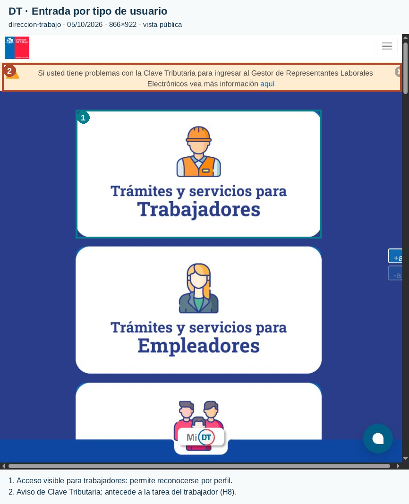
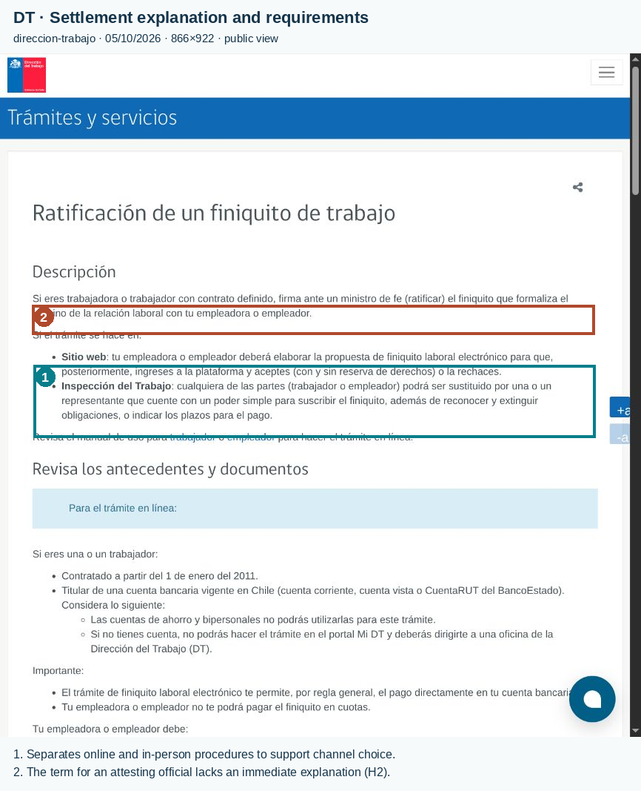
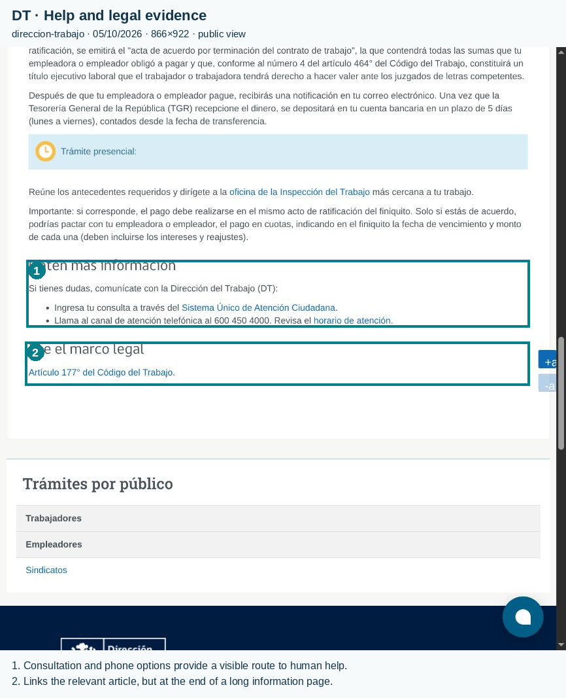
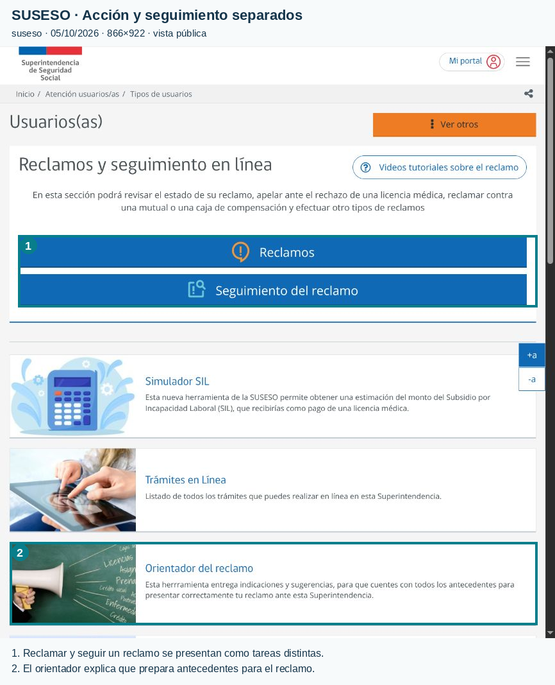
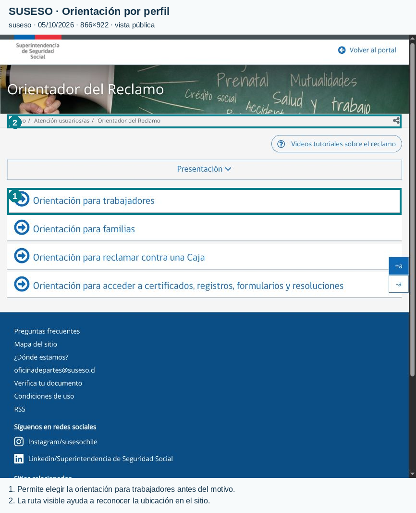
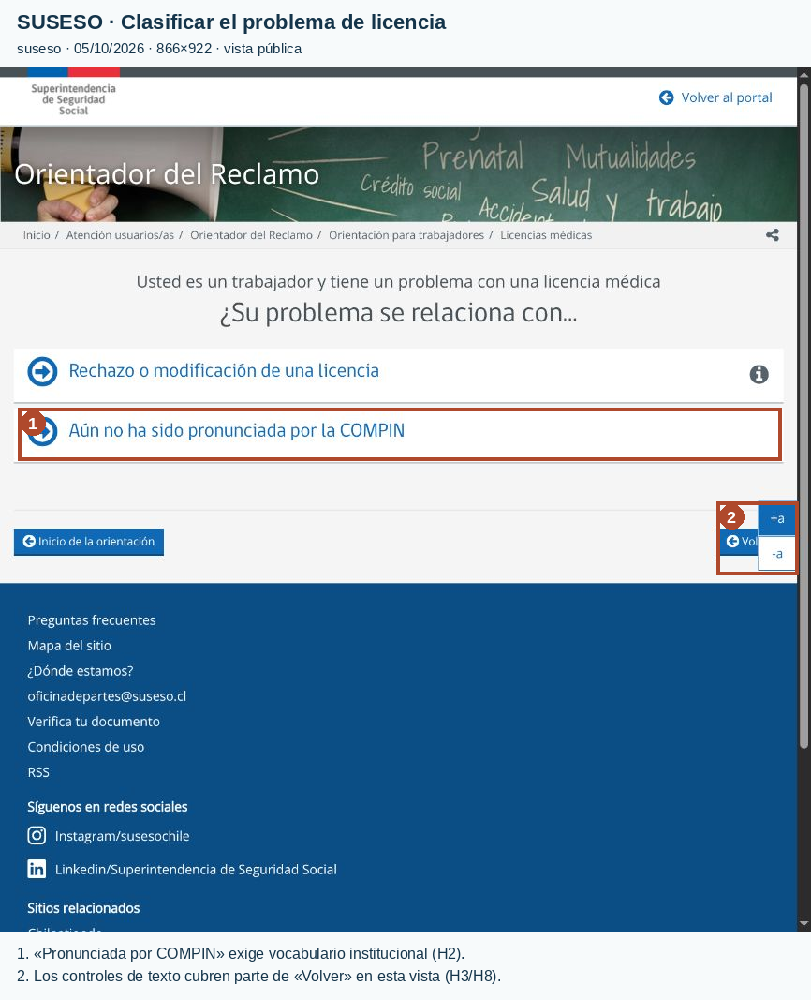
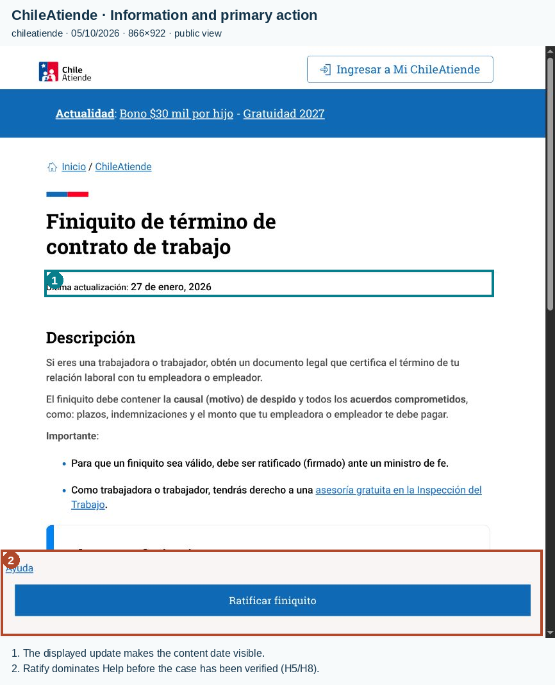
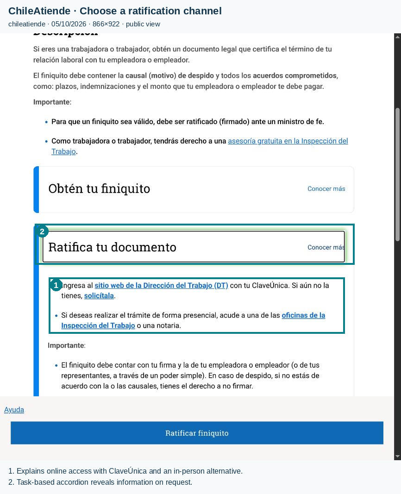
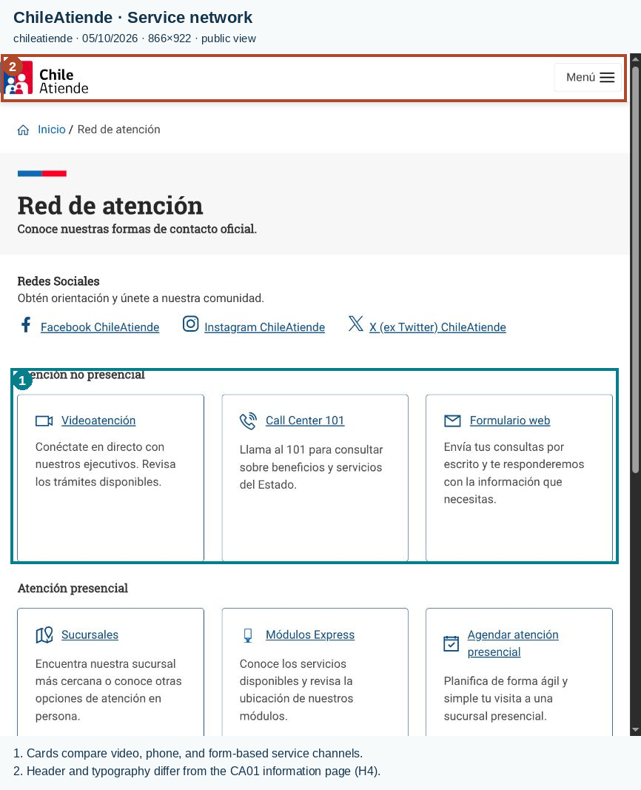
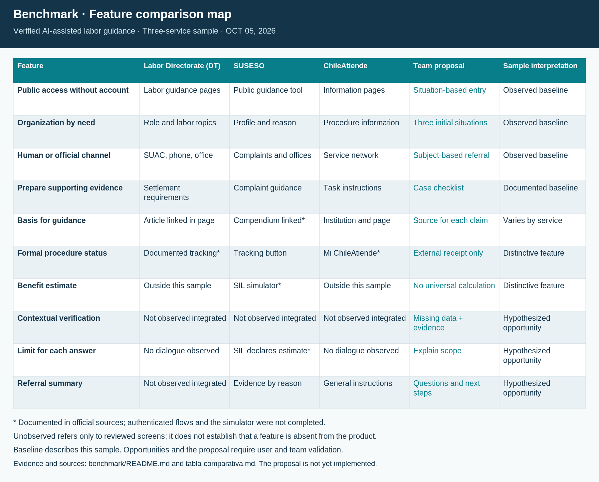

# La orientación laboral exige confianza verificable

**La oportunidad del proyecto consiste en ayudar al trabajador a entender su situación antes de iniciar una gestión oficial, con evidencia visible y una derivación pertinente.** Dirección del Trabajo (DT), SUSESO y ChileAtiende aportan patrones complementarios: acceso por perfil, preparación y seguimiento, y explicación por necesidad. Las pantallas públicas también muestran fricciones relevantes para las personas UX: jerga, apoyo distante del punto de decisión y acciones cuya prominencia no coincide con la necesidad de comprender primero. El análisis compara experiencias y no determina derechos individuales ni audita legalmente a las instituciones. La propuesta del grupo sigue siendo un concepto: sus capacidades no se presentan como implementadas. Este benchmark fundamenta decisiones para el [Customer Journey](../customer-journey/README.md) y para el posterior prototipo.

## Tres categorías permiten comparar sin confundir competencias

La pregunta de investigación es cómo ofrecer orientación comprensible y verificable sobre primera licencia, horas extra impagas y finiquito, sin transformar una explicación en una decisión jurídica. La fecha de consulta es **5 de octubre de 2026**. Se revisaron fuentes oficiales y nueve capturas públicas, tres por herramienta, obtenidas con un área visible de 866 × 922 píxeles. Esta muestra permite observar páginas, etiquetas, jerarquía y un acordeón abierto; no representa el flujo completo ni todos los dispositivos. Ningún sitio consultado publicó un número de versión en esas páginas; la fecha de actualización de una ficha no equivale a la versión del producto.

El ecosistema bruto considerado comprende DT/Mi DT, SUSESO, ChileAtiende, BCN/Ley Chile y ChatGPT. **DT es la comparación funcional directa** por su orientación y trámites laborales; SUSESO es un **análogo sectorial** por preparación, reclamos y seguimiento en seguridad social; ChileAtiende es una **referencia de diseño de información y derivación**. Se seleccionaron esos tres porque cubren los problemas del repositorio y permiten contrastar interfaces públicas sin asumir que realizan el mismo trabajo. El Centro de Consultas DT organiza temas laborales; SUSESO delimita instituciones y materias fiscalizadas; ChileAtiende comunica beneficios, requisitos y canales. Estas categorías son una decisión metodológica del estudio. ([DT](https://www.dt.gob.cl/portal/1628/w3-channel.html), [SUSESO](https://www.suseso.gob.cl/601/w3-propertyvalue-10381.html), [ChileAtiende](https://www.chileatiende.gob.cl/que-es-chileatiende)).

BCN/Ley Chile se conserva como fuente normativa complementaria, pero se excluye de la matriz principal porque su foco documental no coincide con la preparación y derivación estudiadas; no se inspeccionó su interfaz de consulta. ChatGPT se reconoce como sustituto conversacional general y se excluye de las tres experiencias institucionales por ese alcance distinto. Su documentación reconoce respuestas incorrectas y la necesidad de verificar información: esa limitación refuerza el problema de confianza, pero no constituye una evaluación de su desempeño laboral. La selección no demuestra liderazgo de mercado ni ausencia de alternativas comerciales. ([Ley Chile](https://www.bcn.cl/leychile/Consulta/), [Documentación de OpenAI](https://help.openai.com/en/articles/8313428-does-chatgpt-tell-the-truth)).

El inventario explicita plataformas y destinos revisados; no constituye un censo de mercado.

| Nombre | Plataforma y URL oficial | Clasificación | Selección para la matriz |
| --- | --- | --- | --- |
| Dirección del Trabajo / Mi DT | Web institucional y portal de trámites: [dt.gob.cl](https://www.dt.gob.cl/portal/1626/w3-channel.html) | Comparación funcional directa | Incluida: orientación laboral y preparación de finiquito/horas extra. |
| SUSESO | Web institucional y acceso PAE: [suseso.gob.cl](https://www.suseso.gob.cl/606/w3-propertyvalue-610.html) | Análogo sectorial | Incluida: licencia, preparación y seguimiento de reclamos. |
| ChileAtiende | Portal web informativo: [chileatiende.gob.cl](https://www.chileatiende.gob.cl/que-es-chileatiende) | Referencia de diseño | Incluida: lenguaje cotidiano, acciones y canales. |
| BCN / Ley Chile | Aplicación web de consulta normativa: [Ley Chile](https://www.bcn.cl/leychile/Consulta/) | Fuente complementaria | Excluida: foco documental; conservar como respaldo normativo. |
| ChatGPT | Asistente conversacional web: [documentación oficial](https://help.openai.com/en/articles/8313428-does-chatgpt-tell-the-truth) | Sustituto conversacional general | Excluido: alcance distinto de los tres servicios institucionales. |

La [tabla comparativa](tabla-comparativa.md) aplica diez dimensiones de la pauta —identificación, perfil, valor, funciones priorizadas, onboarding, navegación, diseño, accesibilidad observable, positivos y problemas— y cuatro del dominio: trazabilidad normativa, límites e incertidumbre, derivación competente y privacidad/control. Distingue **observado**, **documentado** y **propuesto**. Las asociaciones con Nielsen interpretan indicios de interfaz; no son resultados de pruebas ni puntajes de severidad medidos. H2 refiere a lenguaje familiar; H3, control; H4, consistencia; H5, prevención de errores; H6, reconocimiento; H8, jerarquía relevante; H10, ayuda contextual. ([Heurísticas de Nielsen](https://www.nngroup.com/articles/ten-usability-heuristics/)).

## La DT ofrece autoridad, pero el respaldo queda lejos de la decisión

La DT es pertinente para Guillermo y Joseph: permite consultar derechos laborales y acceder a servicios formales. Las funciones se ordenan aquí por relevancia para esos escenarios: orientación temática, preparación del trámite, acceso a Mi DT y atención humana. **La lectura pública precede a la autenticación.** La documentación describe RUN y ClaveÚnica para entrar a Mi DT; no se observó la cuenta ni el onboarding interno. Tampoco se fusiona la ruta del empleador con la del trabajador. ([Acceso Mi DT](https://www.dt.gob.cl/portal/1628/w3-article-116464.html), [Perfiles documentados](https://www.dt.gob.cl/portal/1628/w3-article-116467.html)).

En DT01, las tarjetas de trabajadores y empleadores constituyen un primer positivo: hacen reconocible el perfil pertinente (H6). En DT03, un segundo positivo es la presencia de ayuda por SUAC y teléfono junto con un enlace al marco legal: ofrece apoyo verificable (H10). Sin embargo, el aviso sobre Clave Tributaria del gestor de representantes laborales ocupa la parte superior de DT01, antes de la entrada del trabajador. Para el objetivo de orientación de Joseph, esa prioridad introduce información de otro perfil (H8). En DT02–DT03, la extensión de la ficha y el respaldo legal al final obligan a recorrer contenido y relacionarlo con la explicación inicial (H6/H8). Son problemas potenciales de localización, no evidencia de abandono. ([Portada DT](https://www.dt.gob.cl/portal/1626/w3-channel.html), [Ficha de finiquito](https://dt.gob.cl/portal/1626/w3-article-117245.html)).

La ficha explica modalidades y documentos, pero términos como “ministro de fe” permanecen sin glosario en el fragmento observado; el manual externo amplía instrucciones sin sustituir una ayuda breve en contexto. Visualmente predominan azul institucional, tarjetas grandes y títulos de sección. Los controles de tamaño de texto son visibles, y DT01 muestra desplazamiento horizontal: ninguno de estos indicios acredita accesibilidad completa. El recorrido público observado fue portada → [Trabajadores](https://www.dt.gob.cl/portal/1626/w3-propertyvalue-26864.html) → ficha de finiquito: tres páginas. Las capturas muestran portada y ficha arriba/abajo; la profundidad transaccional de Mi DT queda desconocida. ([Ficha DT](https://dt.gob.cl/portal/1626/w3-article-117245.html)).

*DT01. Perfiles reconocibles; el aviso de representantes laborales antecede la entrada del trabajador.*

*DT02. Descripción y documentos; el manual externo no reemplaza un glosario breve en contexto.*

*DT03. Ayuda y fundamento disponibles al final de una ficha extensa.*

## SUSESO separa intenciones, aunque exige reconocer lenguaje institucional

SUSESO resulta especialmente pertinente para Benjamin por sus servicios de seguridad social. El orden funcional relevante es orientación, preparación de antecedentes, simulación estimada del subsidio, reclamo y seguimiento. En SU01 se distinguen “Reclamos” y “Seguimiento del reclamo”: **primer positivo, acciones reconocibles** sin confundir iniciar y consultar (H6). SU02 selecciona orientación para trabajadores, familias u otras necesidades: segundo positivo, clasificación por perfil y situación (H2/H6). No se inspeccionó un expediente real ni se midió cuánto tarda una persona en elegir. ([Usuarios](https://www.suseso.gob.cl/606/w3-propertyvalue-610.html), [Orientador](https://www.suseso.gob.cl/606/w3-propertyname-509.html)).

El tramo observado permite describir orientador → trabajadores → licencias → dos situaciones. SU03 presenta rechazo/modificación y ausencia de pronunciamiento de COMPIN. Para una primera licencia, “pronunciada” y la sigla institucional requieren conocimiento previo sin definición visible en ese fragmento: **primer problema, jerga** (H2). Además, el control lateral de tamaño de texto tapa parcialmente “Volver” en el área capturada: segundo problema, interferencia con la salida (H3/H8). La interfaz muestra opciones grandes y contraste aparente azul/blanco, pero el contraste no fue medido. La superposición corresponde a ese tamaño de ventana; no se generaliza a todos los dispositivos. ([Licencias en el orientador](https://www.suseso.gob.cl/606/w3-propertyvalue-586.html)).

El contenido público del simulador declara que su resultado es estimado y delimita qué casos considera. Ese patrón es transferible: explicar supuestos antes de entregar una cifra. El ciclo publicado documenta preparación, revisión y consulta de estados, pero no demuestra que las pantallas privadas actuales coincidan exactamente con el tutorial. La pantalla de ingreso ofrece ClaveÚnica y Clave Tributaria; una mención histórica a crear contraseña no se toma como alternativa personal vigente. ([Simulador](https://www.suseso.gob.cl/606/w3-article-711911.html), [Ciclo del reclamo](https://www.suseso.gob.cl/606/w3-propertyvalue-562466.html), [Ingreso PAE](https://pae.suseso.gob.cl/pae-web/loginCiudadano)).

*SU01. Iniciar y seguir un reclamo son acciones distintas; el simulador se presenta como estimación.*

*SU02. La selección por perfil prepara la ruta antes de pedir autenticación.*

*SU03. Lenguaje institucional y superposición parcial de “Volver” en el tamaño observado.*

## ChileAtiende explica por acciones y necesita equilibrar ayuda y trámite

ChileAtiende funciona como referencia de información, no como autoridad que resuelve el caso laboral. Ordenamos sus capacidades por relevancia: explicación de la necesidad, requisitos y pasos, derivación a la institución responsable y selección del canal. La ficha de Joseph permite observar lectura pública → sección de ratificación abierta → enlace externo a DT o alternativa presencial; no se completó el trámite. La fecha **27 de enero de 2026** aparece como última actualización de esa ficha. ([Finiquito](https://www.chileatiende.gob.cl/fichas/33522)).

Un primer positivo en CA01 es la aclaración “causal (motivo)”: traduce un término especializado (H2). Un segundo positivo en CA02 son las acciones separadas “Obtén” y “Ratifica”, con información desplegable y destinos explícitos (H6/H8). La asesoría gratuita está enlazada en la descripción. No obstante, la barra fija destaca “Ratificar finiquito” por encima de “Ayuda”; para Joseph, que busca comprender antes de actuar, esa jerarquía merece revisión (H8). El problema no es la existencia del botón sino su prioridad respecto del objetivo del escenario. ([Ficha de finiquito](https://www.chileatiende.gob.cl/fichas/33522)).

CA03 muestra canales remotos y presenciales mediante tarjetas explicativas. Entre ficha y red de atención cambian cabecera y tratamiento tipográfico: **segundo problema, consistencia visual** (H4). Las redes sociales anteceden a canales de atención, una prioridad adicional poco alineada con una necesidad urgente (H8). Los enlaces subrayados y el contorno visible del acordeón ayudan a reconocer interacción; no se comprobaron teclado ni lector de pantalla. El portal no debe recibir crédito por resolver, cargar documentos o calcular finiquitos: las fichas derivan al servicio responsable. ([Red de atención](https://www.chileatiende.gob.cl/red-de-atencion)).

*CA01. Traducción de términos y fecha visibles; ratificar domina visualmente a la ayuda.*

*CA02. La sección abierta identifica DT, ClaveÚnica y alternativa presencial.*

*CA03. Canales explicados; redes sociales primero y tratamiento visual distinto de la ficha.*

## El prototipo debe priorizar comprensión, evidencia y control

**Garrett: Estrategia.** La necesidad que guía el concepto es comprender con respaldo antes de actuar; su objetivo de producto es orientar hacia la instancia pertinente con confianza explicada. Las prioridades siguientes son **propuestas para validación del equipo, no decisiones aprobadas**. Los hallazgos refinan el [Canvas](../value_proposition.png) y las [personas UX](../ux-personas/). Para Benjamin, proponemos adoptar el acceso por situación y la preparación progresiva de SUSESO, rechazando comenzar con jerga o un reclamo prematuro. Para Guillermo, proponemos adoptar fuentes oficiales y apoyo humano de DT, rechazando pedir identificación al iniciar una orientación general o prometer ausencia de represalias. Su ocupación no basta para determinar el régimen de jornada: corresponde preguntar el tipo de transporte y registros disponibles antes de orientar. Para Joseph, proponemos adoptar explicación cotidiana y alternativas de ChileAtiende, rechazando dar más prominencia a firmar que a comprender. Estas son **hipótesis de diseño**, no preferencias comprobadas con las personas. ([Consulta sectorial DT](https://dt.gob.cl/portal/1628/w3-article-60075.html)).

**Garrett: Alcance.** Proponemos priorizar un recorrido acotado en el prototipo: seleccionar el problema, reunir contexto mínimo, explicar con fuente y fecha de revisión, mostrar qué falta para responder y preparar una derivación. Proponemos que la fuente acompañe la afirmación, en lugar de quedar al final de un documento. El nivel de confianza propuesto en el Canvas se expresará mediante razones comprensibles —fuente pertinente, antecedentes faltantes o discrepancias—, sin porcentajes arbitrarios ni una etiqueta que prometa certeza jurídica. El mapa de capacidades resume lo observado, lo documentado y lo que se propone ensayar.

*Mapa de capacidades. La propuesta del grupo es una hipótesis; las capacidades documentadas no equivalen a pruebas ejecutadas.*

Una segunda prioridad es continuidad: resumen revisable, checklist de documentos y alternativa de orientación humana. Se propone guardar información únicamente por decisión explícita del usuario, explicar su uso y permitir eliminarla; **no se verificaron políticas de retención ni controles de borrado** de los tres referentes. La lectura pública demuestra que es posible ofrecer información sin iniciar sesión, pero no prueba ausencia de rastreo. El benchmark no recomienda recolectar antecedentes médicos para explicar una primera licencia ni almacenar documentos laborales en la primera versión.

El Canvas plantea derivación automática a la Inspección del Trabajo ante casos complejos. La investigación exige refinar ese destino: **la derivación depende de materia y etapa**. DT orienta asuntos laborales, mientras las rutas de licencias pueden requerir COMPIN o SUSESO. No se convierte una discrepancia entre resúmenes oficiales en una instrucción individual; se muestra el límite y se verifica la fuente competente. Se excluyen del alcance inicial firma o envío de trámites, cálculo definitivo de indemnizaciones, diagnóstico médico, pronunciamiento sobre legalidad y garantías de éxito de reclamos. ([Orientación DT sobre apelación](https://www.dt.gob.cl/portal/1628/w3-article-95287.html), [Compendio SUSESO](https://www.suseso.gob.cl/622/w3-propertyvalue-788701.html)).

## La siguiente evidencia debe comprobar comprensión antes de acción

**El estado es fase 2 documental con inspección de interfaz pública.** Quedan pendientes el uso supervisado de flujos autenticados, la comprobación de accesibilidad y la validación grupal del diagnóstico y las prioridades. No se atribuye esta revisión a reuniones, entrevistas, reseñas o pruebas que no ocurrieron. Para avanzar, el equipo debe acordar escenarios equivalentes por persona y observar si participantes pueden explicar su situación, localizar el respaldo y escoger una ayuda pertinente sin confundir orientación con resolución oficial.

El [Customer Journey](../customer-journey/README.md) traduce estas hipótesis a puntos de contacto y oportunidades; sus emociones deben identificarse como inferidas. La evaluación posterior necesita observar especialmente tres errores: Benjamin inicia una reclamación que no corresponde a su etapa; Guillermo aplica una regla de jornada sin clasificar su trabajo; Joseph interpreta una respuesta como autorización para firmar. Reducir esas confusiones es un criterio más útil para este proyecto que contar funciones o declarar ganador a un portal con otro mandato.

## Informe de entrega en LaTeX

[PDF con formato APA 7](benchmark.pdf) · [Fuentes, portada UFRO y compilación](latex/README.md). Edición de formato del 8 de octubre de 2026; los hallazgos y capturas conservan su fecha de observación del 5 de octubre. El informe incluye citas autor-fecha, referencias alfabéticas, cinco tablas y diez figuras. La portada institucional se adaptó del informe de Redes indicado por el usuario.
