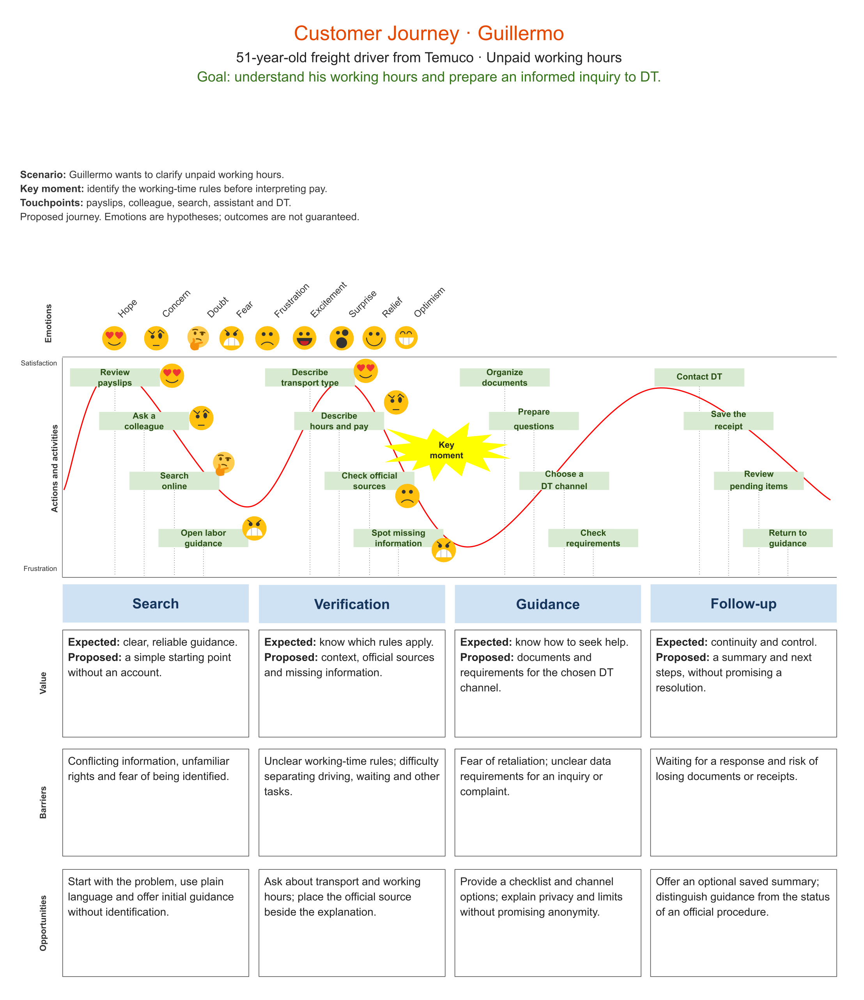

# Customer Journey de Guillermo

Entrega única de la actividad 4 del proyecto **Orientación en derechos laborales asistida por IA con verificación**, rediseñada el **8 de octubre de 2026** conforme al alcance indicado por el usuario. **Todo el texto del mapa y de su ficha de contenido está en inglés**, por solicitud expresa.

[Editar en la plantilla del profesor](https://docs.google.com/drawings/d/1HmiUZjjn4FukMQQF9UjHnj1F81ZRwnVklLkbzSECMUQ/edit) · [PDF](guillermo.pdf) · [Ficha textual](guillermo.md) · [PNG](guillermo.png) · [SVG](guillermo.svg).

## Persona y objetivo

Guillermo tiene 51 años, conduce transporte de carga en Temuco y necesita aclarar horas que considera impagas. Busca información confiable y teme represalias. Corresponde a la persona de [ux-personas/2.png](../ux-personas/2.png): la imagen usa «William» en el título y «Guillermo» en la descripción; esta entrega utiliza **Guillermo**, según la indicación del usuario.

El objetivo es **aclarar su jornada y preparar una consulta respaldada ante la Dirección del Trabajo**. Su ocupación por sí sola no permite determinar el régimen de jornada: el mapa incluye preguntas sobre transporte, actividades y registros antes de interpretar pagos.

## Plantilla y estructura

Se rehízo el Google Drawing proporcionado, conservando la disposición original de acciones, curva roja, símbolos emocionales, momento clave y filas de valor, barreras y oportunidades. El archivo se llama **Customer Journey - Guillermo** y mantiene objetos editables en Google Drawings. Se acortaron los textos, se unificaron las celdas sin cursivas y se reforzaron contraste y jerarquía: etapas a 18 puntos, celdas a 14 puntos y acciones a 11 puntos.

| Etapa original | Etapa del caso | Acciones |
| --- | --- | --- |
| Búsqueda de información | Search | Review payslips, Ask a colleague, Search online, Open labor guidance. |
| Comparación | Verification | Describe transport type, Describe hours and pay, Check official sources, Spot missing information. |
| Compra / booking | Guidance | Organize documents, Prepare questions, Choose a DT channel, Check requirements. |
| Viaje | Follow-up | Contact DT, Save the receipt, Review pending items, Return to guidance. |

Cada etapa tiene un recuadro de valor esperado/propuesto, uno de barreras y uno de oportunidades. El momento clave consiste en **identificar el régimen de jornada y reconocer datos faltantes antes de interpretar las horas impagas**.

## Evidencia y validación

El recorrido es una **experiencia propuesta**, basada en la persona UX, el [Canvas](../value_proposition.png), el [encargo](../docs/project-brief.md), la clase de Customer Journey en `/home/gsm/Documents/docs_ux` y el [benchmark](../benchmark/README.md). Secuencia, canales, dispositivos y emociones son hipótesis: no hay entrevistas o sesiones de uso documentadas que validen este mapa.

La línea representa cambios cualitativos entre satisfacción y frustración; el eje horizontal indica orden de acciones, no días ni plazos legales. La esperanza de encontrar ayuda disminuye ante fuentes contradictorias, vuelve al aclarar contexto, cae al reconocer información insuficiente, mejora al preparar una consulta y puede disminuir de nuevo mientras espera. Consultar o guardar un resumen no garantiza pago ni resolución favorable.

Validar con participantes que representen este perfil, usando antecedentes ficticios y pensamiento en voz alta. Observar si pueden explicar qué datos faltan, distinguir orientación de confirmación del pago, elegir un canal oficial y comprender qué datos requiere. Preguntar por sus emociones sin imponer las de la leyenda; modificar la curva según los relatos obtenidos.

## Archivos y mantenimiento

La fuente editable de la composición es **Google Drawings**. En esta revisión se descargó el **SVG nativo** mediante Archivo → Descargar → Gráficos vectoriales escalables. PNG y PDF se renderizaron localmente con librsvg a partir de esa exportación. Así se conservan los símbolos, colores y formas originales sin sustituir fuentes ni reconstruir objetos del dibujo.

Google convierte el texto del SVG descargado en trazados vectoriales; el PDF conserva esos trazados y no ofrece texto seleccionable. [guillermo.md](guillermo.md), también en inglés, ofrece una lectura textual completa. La [captura del documento guardado](guillermo-en-google.jpg) permite comprobar el resultado en Google Drawings. Las versiones anteriores quedan recuperables en Git. [Instrucciones de reproducción](../scripts/README.md).
