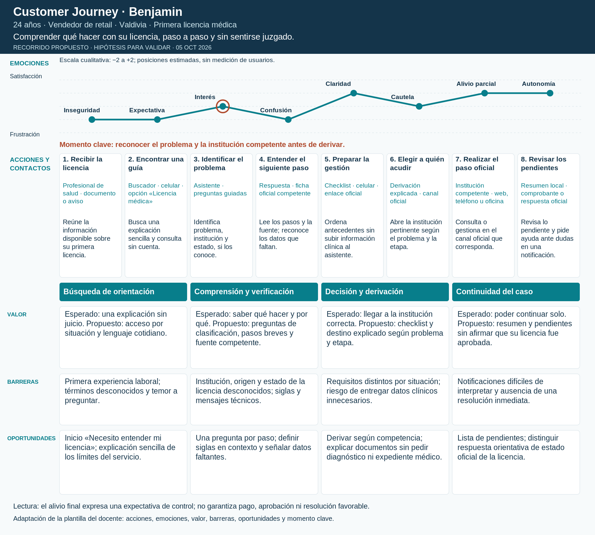

# Customer Journey de Benjamin

**Perfil:** 24 años · Vendedor de retail · Valdivia · Primera licencia médica.

**Objetivo:** Comprender qué hacer con su licencia, paso a paso y sin sentirse juzgado.

**Escenario:** Es su primera licencia; aún no se conoce su institución, tipo de problema ni estado de tramitación.

**Tipo:** recorrido propuesto (to-be), construido a partir de la persona UX y del Canvas; hipótesis, no registro de una sesión ni entrevista. Uso del celular, canales y secuencia requieren validación.

[PDF](benjamin.pdf) · [SVG editable](benjamin.svg)

## Recorrido y puntos de contacto

| Fase | Contacto | Canal y dispositivo | Acción del usuario | Fricción | Emoción estimada |
| --- | --- | --- | --- | --- | --- |
| Búsqueda de orientación | 1. Recibir la licencia | Profesional de salud · documento o aviso | Reconoce que necesita entender el proceso y reúne la información disponible. | Tiene miedo de equivocarse en su primer trabajo. | Inseguridad (-1) |
| Búsqueda de orientación | 2. Encontrar una guía | Buscador · celular · opción «Licencia médica» | Busca una explicación sencilla y consulta el asistente sin cuenta. | No sabe quién responde ni qué significa cada institución. | Expectativa (-1) |
| Comprensión y verificación | 3. Identificar el problema | Asistente · preguntas guiadas | Distingue entrega/tramitación, autorización, rechazo o pago; indica institución si la conoce. | No todos los problemas de licencia tienen el mismo destino. | Interés (+0) |
| Comprensión y verificación | 4. Entender el siguiente paso | Respuesta · ficha oficial competente | Lee pasos breves, glosario y respaldo; revisa qué datos siguen faltando. | Puede confundir empleador, COMPIN, Isapre y SUSESO. | Confusión (-1) |
| Decisión y derivación | 5. Preparar la gestión | Checklist · celular · enlace oficial | Ordena los antecedentes necesarios según su problema, sin subir información clínica al asistente. | La afiliación y la etapa condicionan los requisitos. | Claridad (+1) |
| Decisión y derivación | 6. Elegir a quién acudir | Derivación explicada · canal oficial | Abre el organismo pertinente: DT por cuestión laboral; institución de salud/COMPIN/SUSESO según la situación. | No se puede fijar una ruta o plazo universal con los datos actuales. | Cautela (+0) |
| Continuidad del caso | 7. Realizar el paso oficial | Institución competente · web, teléfono u oficina | Consulta o gestiona en el canal que corresponda y conserva su comprobante si lo recibe. | La resolución depende del organismo y de los antecedentes. | Alivio parcial (+1) |
| Continuidad del caso | 8. Revisar los pendientes | Resumen local · comprobante o respuesta oficial | Comprueba qué quedó pendiente y pide ayuda si no comprende una notificación. | Puede creer que orientación equivale a aprobación de la licencia. | Autonomía (+1) |

## Valor, barreras y oportunidades

| Fase | Valor esperado y propuesto | Barrera | Oportunidad |
| --- | --- | --- | --- |
| Búsqueda de orientación | Esperado: una explicación sin juicio. Propuesto: acceso por situación y lenguaje cotidiano. | Primera experiencia laboral; términos desconocidos y temor a preguntar. | Inicio «Necesito entender mi licencia»; explicación sencilla de los límites del servicio. |
| Comprensión y verificación | Esperado: saber qué hacer y por qué. Propuesto: preguntas de clasificación, pasos breves y fuente competente. | Institución, origen y estado de la licencia desconocidos; siglas y mensajes técnicos. | Una pregunta por paso; definir siglas en contexto y señalar datos faltantes. |
| Decisión y derivación | Esperado: llegar a la institución correcta. Propuesto: checklist y destino explicado según problema y etapa. | Requisitos distintos por situación; riesgo de entregar datos clínicos innecesarios. | Derivar según competencia; explicar documentos sin pedir diagnóstico ni expediente médico. |
| Continuidad del caso | Esperado: poder continuar solo. Propuesto: resumen y pendientes sin afirmar que su licencia fue aprobada. | Notificaciones difíciles de interpretar y ausencia de una resolución inmediata. | Lista de pendientes; distinguir respuesta orientativa de estado oficial de la licencia. |

## Momento clave

Momento clave: reconocer el problema y la institución competente antes de derivar.

## Qué validar

Comprobar que puede explicar el siguiente paso y su destino, y que distingue orientación, tramitación y resolución oficial.

Observar comprensión, elección de canal, datos compartidos y reacción a la incertidumbre. Contrastar la curva con el relato de participantes; no usar los valores emocionales como métricas reales.

## Trazabilidad

[Personas UX](../README.md) · [Canvas de valor](../value_proposition.png) · [Benchmark y fuentes oficiales](../benchmark/README.md) · [Criterios y adaptación de la plantilla](README.md).
