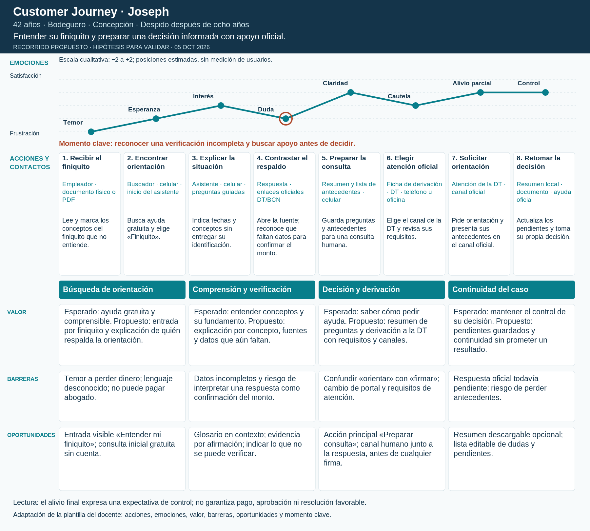

# Customer Journey de Joseph

**Perfil:** 42 años · Bodeguero · Concepción · Despido después de ocho años.

**Objetivo:** Entender su finiquito y preparar una decisión informada con apoyo oficial.

**Escenario:** Recibe una propuesta que no comprende; necesita revisar antecedentes antes de decidir.

**Tipo:** recorrido propuesto (to-be), construido a partir de la persona UX y del Canvas; hipótesis, no registro de una sesión ni entrevista. Uso del celular, canales y secuencia requieren validación.

[PDF](joseph.pdf) · [SVG editable](joseph.svg)

## Recorrido y puntos de contacto

| Fase | Contacto | Canal y dispositivo | Acción del usuario | Fricción | Emoción estimada |
| --- | --- | --- | --- | --- | --- |
| Búsqueda de orientación | 1. Recibir el finiquito | Empleador · documento físico o PDF | Lee la propuesta y marca conceptos que no entiende. | No sabe si el monto corresponde. | Temor (-2) |
| Búsqueda de orientación | 2. Encontrar orientación | Buscador · celular · inicio del asistente | Busca ayuda gratuita y entra a la opción «Finiquito». | Necesita reconocer quién respalda el servicio. | Esperanza (-1) |
| Comprensión y verificación | 3. Explicar la situación | Asistente · celular · preguntas guiadas | Indica fechas, causal declarada y conceptos de la propuesta; evita datos identificatorios. | Puede no tener todos los antecedentes. | Interés (+0) |
| Comprensión y verificación | 4. Contrastar el respaldo | Respuesta · enlaces oficiales DT/BCN | Revisa explicación, fuente y datos faltantes; detecta que no se puede confirmar su monto. | Una respuesta clara podría parecer una garantía. | Duda (-1) |
| Decisión y derivación | 5. Preparar la consulta | Resumen y lista de antecedentes · celular | Guarda las preguntas y los conceptos que necesita revisar con una persona. | Debe diferenciar preparación de una decisión jurídica. | Claridad (+1) |
| Decisión y derivación | 6. Elegir atención oficial | Ficha de derivación · DT · teléfono u oficina | Elige canal y revisa requisitos antes de salir del asistente. | Cambio de sitio y eventual autenticación. | Cautela (+0) |
| Continuidad del caso | 7. Solicitar orientación | Atención de la DT · canal oficial | Presenta antecedentes y preguntas; la respuesta depende de la atención real. | El asistente no puede asegurar la resolución. | Alivio parcial (+1) |
| Continuidad del caso | 8. Retomar la decisión | Resumen local · documento · ayuda oficial | Actualiza pendientes con la orientación recibida y decide por su cuenta. | Necesita volver a la información sin perderla. | Control (+1) |

## Valor, barreras y oportunidades

| Fase | Valor esperado y propuesto | Barrera | Oportunidad |
| --- | --- | --- | --- |
| Búsqueda de orientación | Esperado: ayuda gratuita y comprensible. Propuesto: entrada por finiquito y explicación de quién respalda la orientación. | Temor a perder dinero; lenguaje desconocido; no puede pagar abogado. | Entrada visible «Entender mi finiquito»; consulta inicial gratuita sin cuenta. |
| Comprensión y verificación | Esperado: entender conceptos y su fundamento. Propuesto: explicación por concepto, fuentes y datos que aún faltan. | Datos incompletos y riesgo de interpretar una respuesta como confirmación del monto. | Glosario en contexto; evidencia por afirmación; indicar lo que no se puede verificar. |
| Decisión y derivación | Esperado: saber cómo pedir ayuda. Propuesto: resumen de preguntas y derivación a la DT con requisitos y canales. | Confundir «orientar» con «firmar»; cambio de portal y requisitos de atención. | Acción principal «Preparar consulta»; canal humano junto a la respuesta, antes de cualquier firma. |
| Continuidad del caso | Esperado: mantener el control de su decisión. Propuesto: pendientes guardados y continuidad sin prometer un resultado. | Respuesta oficial todavía pendiente; riesgo de perder antecedentes. | Resumen descargable opcional; lista editable de dudas y pendientes. |

## Momento clave

Momento clave: reconocer una verificación incompleta y buscar apoyo antes de decidir.

## Qué validar

Comprobar que distingue orientación de confirmación del monto y localiza ayuda oficial sin interpretar el asistente como autorización para firmar.

Observar comprensión, elección de canal, datos compartidos y reacción a la incertidumbre. Contrastar la curva con el relato de participantes; no usar los valores emocionales como métricas reales.

## Trazabilidad

[Personas UX](../README.md) · [Canvas de valor](../value_proposition.png) · [Benchmark y fuentes oficiales](../benchmark/README.md) · [Criterios y adaptación de la plantilla](README.md).
