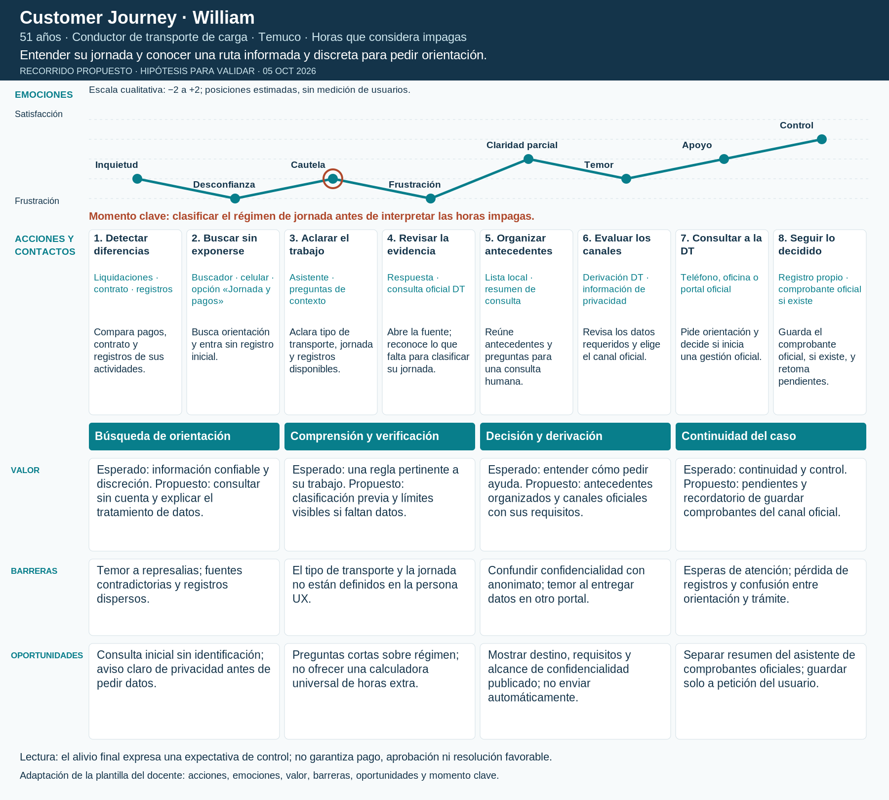

# Customer Journey de William

**Perfil:** 51 años · Conductor de transporte de carga · Temuco · Horas que considera impagas.

**Objetivo:** Entender su jornada y conocer una ruta informada y discreta para pedir orientación.

**Escenario:** Sospecha diferencias de pago; su ocupación no permite determinar por sí sola el régimen aplicable.

**Tipo:** recorrido propuesto (to-be), construido a partir de la persona UX y del Canvas; hipótesis, no registro de una sesión ni entrevista. Uso del celular, canales y secuencia requieren validación.

[PDF](william.pdf) · [SVG editable](william.svg)

## Recorrido y puntos de contacto

| Fase | Contacto | Canal y dispositivo | Acción del usuario | Fricción | Emoción estimada |
| --- | --- | --- | --- | --- | --- |
| Búsqueda de orientación | 1. Detectar diferencias | Liquidaciones · contrato · registros | Compara pagos con las horas y actividades que recuerda. | No sabe qué tiempos corresponden a su jornada. | Inquietud (-1) |
| Búsqueda de orientación | 2. Buscar sin exponerse | Buscador · celular · opción «Jornada y pagos» | Consulta fuentes y abre el asistente sin registro inicial. | Teme represalias y encuentra respuestas distintas. | Desconfianza (-2) |
| Comprensión y verificación | 3. Aclarar el trabajo | Asistente · preguntas de contexto | Identifica modalidad de transporte, jornada pactada y registros disponibles. | No se debe aplicar automáticamente el régimen general. | Cautela (-1) |
| Comprensión y verificación | 4. Revisar la evidencia | Respuesta · consulta oficial DT | Distingue lo documentado de lo que falta y abre la fuente de su situación. | Si no puede clasificar su régimen, la respuesta queda incompleta. | Frustración (-2) |
| Decisión y derivación | 5. Organizar antecedentes | Lista local · resumen de consulta | Reúne contrato, registros y preguntas para atención humana. | Puede mezclar horas de conducción, espera y otras tareas. | Claridad parcial (+0) |
| Decisión y derivación | 6. Evaluar los canales | Derivación DT · información de privacidad | Revisa qué datos requiere el canal oficial y elige cómo pedir orientación. | Discreción inicial no significa denuncia anónima ni ausencia de riesgo. | Temor (-1) |
| Continuidad del caso | 7. Consultar a la DT | Teléfono, oficina o portal oficial | Solicita orientación y decide si corresponde iniciar una gestión oficial. | No hay garantía de respuesta inmediata ni de protección total. | Apoyo (+0) |
| Continuidad del caso | 8. Seguir lo decidido | Registro propio · comprobante oficial si existe | Guarda lo que el canal oficial entregue y retoma pendientes. | No confundir estado del asistente con estado de una denuncia. | Control (+1) |

## Valor, barreras y oportunidades

| Fase | Valor esperado y propuesto | Barrera | Oportunidad |
| --- | --- | --- | --- |
| Búsqueda de orientación | Esperado: información confiable y discreción. Propuesto: consultar sin cuenta y explicar el tratamiento de datos. | Temor a represalias; fuentes contradictorias y registros dispersos. | Consulta inicial sin identificación; aviso claro de privacidad antes de pedir datos. |
| Comprensión y verificación | Esperado: una regla pertinente a su trabajo. Propuesto: clasificación previa y límites visibles si faltan datos. | El tipo de transporte y la jornada no están definidos en la persona UX. | Preguntas cortas sobre régimen; no ofrecer una calculadora universal de horas extra. |
| Decisión y derivación | Esperado: entender cómo pedir ayuda. Propuesto: antecedentes organizados y canales oficiales con sus requisitos. | Confundir confidencialidad con anonimato; temor al entregar datos en otro portal. | Mostrar destino, requisitos y alcance de confidencialidad publicado; no enviar automáticamente. |
| Continuidad del caso | Esperado: continuidad y control. Propuesto: pendientes y recordatorio de guardar comprobantes del canal oficial. | Esperas de atención; pérdida de registros y confusión entre orientación y trámite. | Separar resumen del asistente de comprobantes oficiales; guardar solo a petición del usuario. |

## Momento clave

Momento clave: clasificar el régimen de jornada antes de interpretar las horas impagas.

## Qué validar

Comprobar que entiende qué contexto falta para identificar su jornada y que distingue consulta privada, confidencialidad y un trámite oficial.

Observar comprensión, elección de canal, datos compartidos y reacción a la incertidumbre. Contrastar la curva con el relato de participantes; no usar los valores emocionales como métricas reales.

## Trazabilidad

[Personas UX](../README.md) · [Canvas de valor](../value_proposition.png) · [Benchmark y fuentes oficiales](../benchmark/README.md) · [Criterios y adaptación de la plantilla](README.md).
